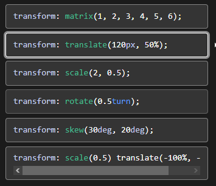

# Animation

IN Css there are 3 accpects of doing animation in css.
    1. Transform
    2. Tranisition
    3. Keyframe

>Transform

--> this capability of css helps us to rotate, move, resize of html element.

there are multiple function available for us in transform

>Transition

-->

transition-duration - how much fast u wanna see the effect lets say if u wanat to increase the font size of a heading and u set transition-duration 5sec then it take aournd 5sec between the intail and final state of the headging from original size to font size u want to increase.