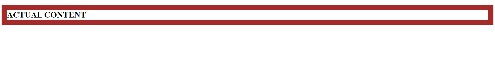
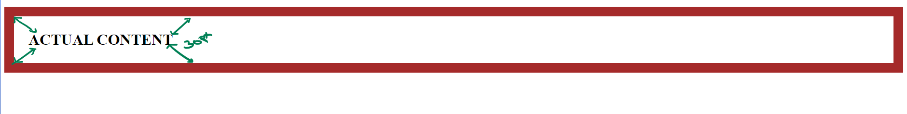
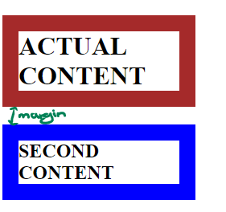
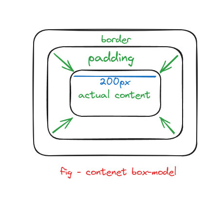
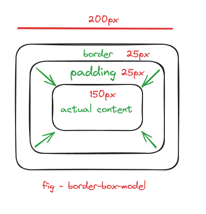

# Box Model 

## box-Sizing

*This is property which helps us to decide the box-model.

# What is box model of CSS ?
--> so, every element(e.x- <div>,<h>...etc) we prepare have multiple component, in CSS they rendered in form of the box.
// boxModelImg
--> This box contain multiple parts.
    1. Actual <CONTENT> --> Some place is taken by this actual content.
    2. Then one more layer padding itself called as <PADDING>.
    3. Then we have <BORDER>.
    4. `MARGIN`


>Now, lets see what this border, padding and CONTENT.

![frontendCourseNotes\HTML notes\8.AdvanceCss\index.html]

```html
    <div>
        <h1 id = "border">ACTUAL CONTENT</h1>
    </div>
```

```css
#border{
    border: solid brown 20px;
    padding: 10px;
}
```
So, we have a width property which we can give to our div tag.

--> Now, this width property can be distributed to different level.
--> So, width will go to actual content, then we have border we can have some width to the border as well.(BEYOND THE BORDER WE HAVE OTHER ELEMENT)
--> Then, we have some padding which is a interal spacing.



--> The above image show how the border width look like, with the actual content.
--> But, the padding is internal spacing beteen the actual content and the border.


*right now the padding only have 10px lets increase and you see how the internal spacing increace.



so, this is how these width is distributed to different level.

>In box model there is one more componet know as margin.

## what is margin?

--> the margin is the space outside of your box(here box means that- the div are box type container which require new line everytime when you create different div). for ex- lets create two div with different styling.



So, this how box-model component work.

# HOW BOX-SIZING ditribution will work?

* SO, we have the `width` propery for giving the width to our coponent(like our div).
```css 
#border2{
    width: 200px;
    border: solid blue 20px;
}
```
**NOW, how this 200px of width gonna calculated?**
> There are two ways to calculate this pixels.



### Content-box-model
* In this type of model all width give to the actual `content part`.
* Size of the box is equal to size of the content.
* here the width of the parent all given to the content. (SO, we need add extra width for padding and border.)



### Border-box-Model
* And, in this type of model we the width is equal to `actual-content-width + padding + border`.
* In this the size of the box is size of the `actual-content-width + padding + border`.
* Whereas the width of the parent is given to `actual-content-width + padding + border`.(dont need to give extra properties for padding and border).

>TO make your box-model be like border-box or content-box we can use the property know as box-sizing.

```css
#border{
    width: 200px;
    border: solid brown 20px;
    box-sizing: border-box;
}
#border2{
    width: 200px;
    border: solid blue 20px;
    box-sizing: content-box;
}
```