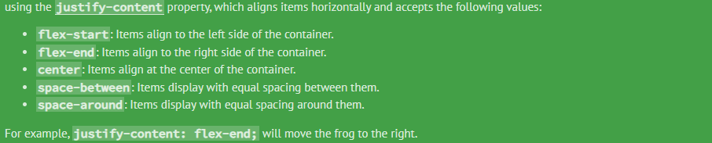
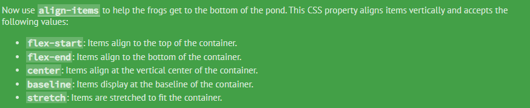
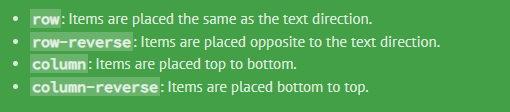
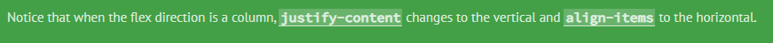
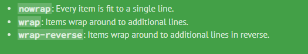
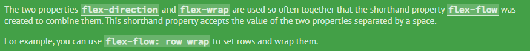

# What is flex box?

* Flexbox, short for Flexible Box Layout, is a CSS layout module that provides a more efficient way to design and structure the layout of items within a container.

* It introduces a two-dimensional layout system for aligning, distributing, and ordering elements within a container, allowing for more responsive and flexible designs.

* In a flex we have a `flex-Container`--> which is a parent element which gonna rap the element outside.
* And, there is a `flex-item` --> they are items which we arrange.

### How start using flex ?

* there is property `display` is css.
```css 
display : flex;
```

>justify-content

it helps to mangae the space between all the element inside the container in a `main axis`;



>align-content

it is similar to justify content to manage space distribution between the item in the `cross-axis`.



In flex- container in order to move item we have two axis -
>main-axis 

>cross-axis

>flex direction

flex-direction. This CSS property defines the direction items are placed in the container, and accepts the following values:



>align-item


>align-self
Another property you can apply to individual items is align-self. This property accepts the same values as align-items and its value for the specific item.


>flex-wrap?


flex-item are forced on a single line or be wrapped on multiple line.

>flex-flow?



